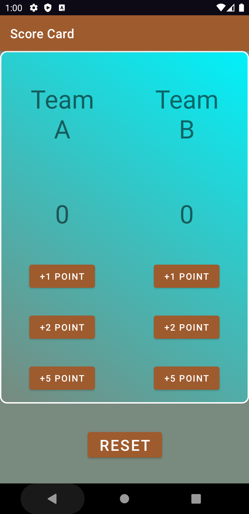
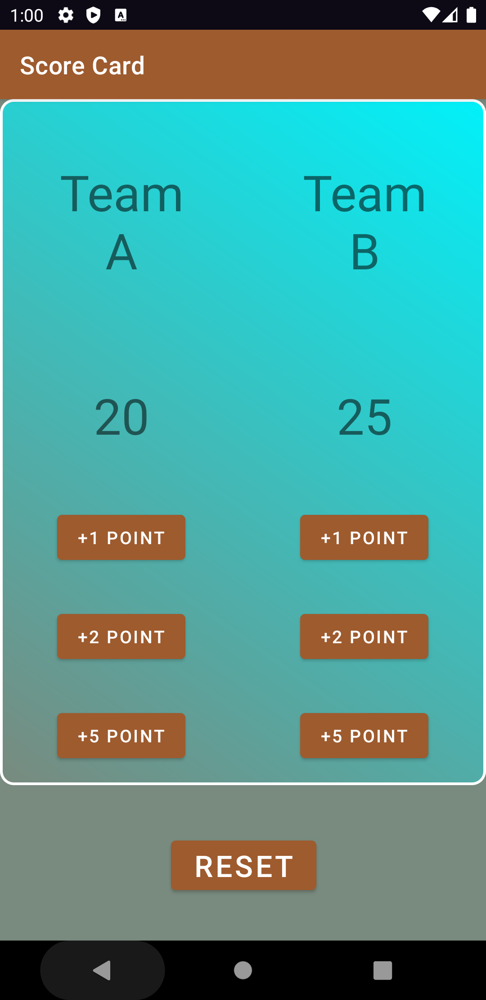

# Score-Card
The app is done as Android Basics: User Input project.

This app keeps score points in the game.The screen is divided into two parts, every part consists of:

  

<ol>
<li>Team name</li>
<li>TextView that displays the score using methods TeamA and TeamB</li>
<li>Three buttons:</li>
<li>+1 Point button which increasing the score for victorious player by 1 point</li>
<li>+2 Point button which increasing the score for victorious player by 2 point</li>
<li>+5 Point button which increasing the score for victorious player by 5 point</li>
<li>Reset button which resets the score for both players back to 0</li>
</ol>
